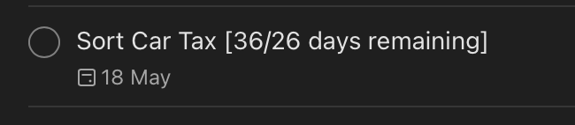

# Todoist Days Remaining

Todoist comes with a free and Pro plan, however, neither of which show the **days remaining** directly within a created task. On the mac desktop app, one can hover the mouse over a task to see days remaining, but nothing exists for mobile.

This project aims to set up an Azure Function, which:
* runs every hour
* authorises to the todoist API via API Key
* reads tasks with their dates, then 
* calculates the days remaining then appends this to each task.

It will append the full days (counting today) and/or the work days remaining too.

## Example output

* If my task is "Pick up drycleaning" with due date 1 week from now, after running this function, my entry would update to:
* "Pick up drycleaning [7/5 days remaining]"

## Setup

Configuration Variables, Required:

* `TODOIST_APIKEY` = your todoist api key from within todoist settings
* `PROJECTS` = comma delimited list of todoist project names you want to process e.g. `"future, birthdays"` - which would traverse two separate todoist projects: Future project, and Birthdays project.

Configuration Variables, Optional:

* `WORKWEEK` = `true` if you want to only output workdays (e.g. 5 for Monday-Sunday) 
* `WORKWEEK` = `false` if you want to only output weekdays (e.g. 7 for Monday-Sunday) 
* Omit `WORKWEEK` variable entirely to get [days/workdays days remaining] e.g. [7/5 days remaining]

## Screenshot

