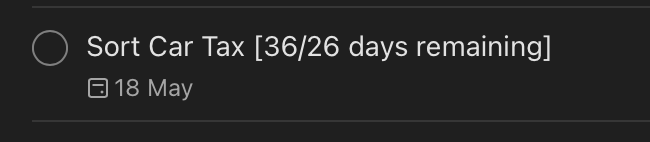

# Todoist Days Remaining

> ⚠️ Project moved to [this repo](https://github.com/MrSimonC/TodoistDaysRemainingACA). Code has been re-engineered into an Azure Container App.

Todoist comes with a free and Pro plan, however, neither of which show the **days remaining** directly within a created task. On the mac desktop app, one can hover the mouse over a task to see days remaining, but nothing exists for mobile.

This project aims to set up an Azure Function, which:
* runs every hour
* authorises to the todoist API via API Key
* reads tasks with their dates, then 
* calculates the days remaining then appends this to each task.

It will append the full days (counting today) and/or the work days remaining too.

## Example output

* If my task is "Pick up drycleaning" with due date 1 week from now, after running this function, my entry would update to:
* "Pick up drycleaning [7/5 days remaining]"
* The 7/5 translates to "7 days and 5 full work days".

## Setup

Configuration Variables, Required:

* `TODOIST_APIKEY` = your todoist api key from within todoist settings
* `PROJECTS_DUE_DATE` = comma delimited list of todoist project names you want to add countdown days to e.g. `"future, birthdays"` - which would traverse two separate todoist projects: Future project, and Birthdays project.
* `PROJECTS_COMPLETE_PAST_EVENTS` = comma delimited list of todoist project names you want to complete tasks of if they fall before today
* `FORCE_WRITE` = always write to each item, even if the entry has correct days (useful for when days were incorrectly written/code has been updated)

## Screenshot

